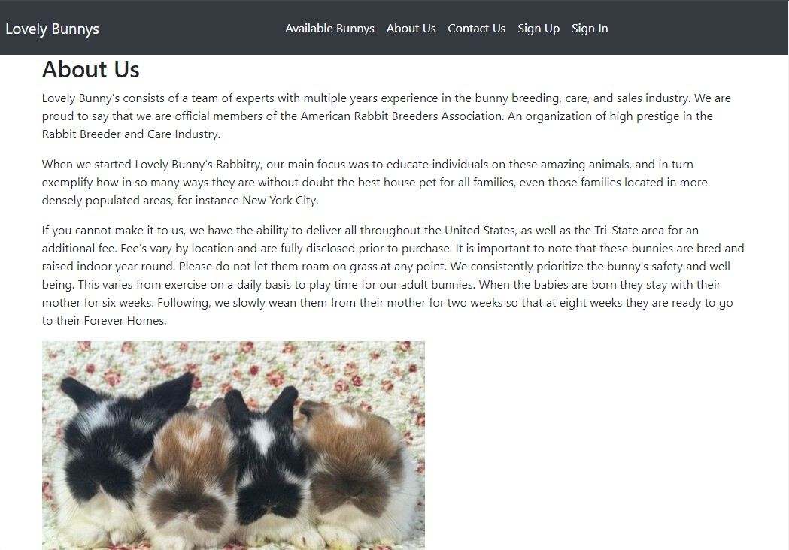
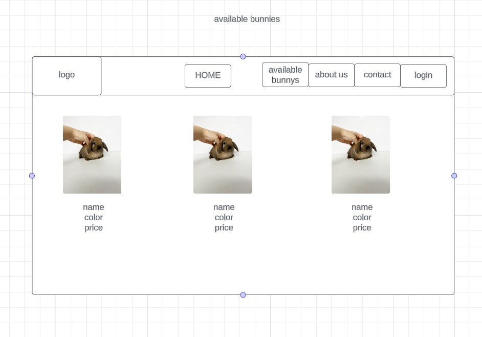
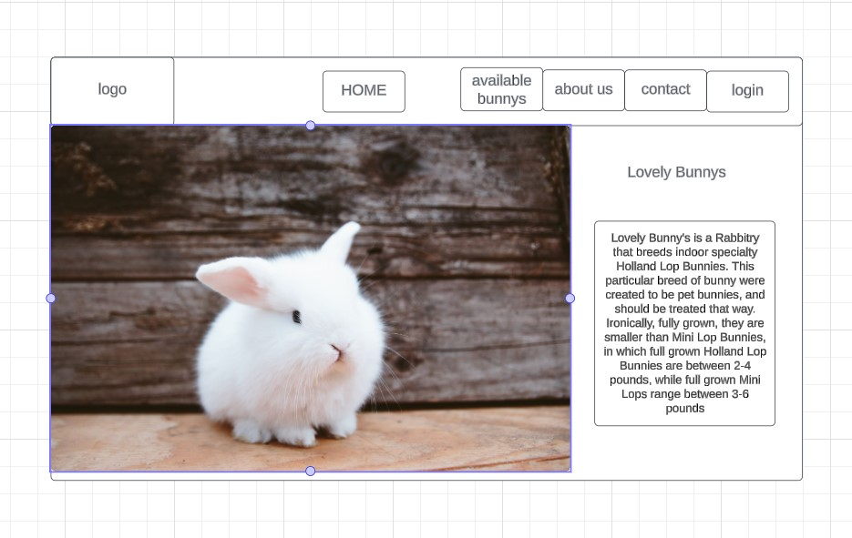
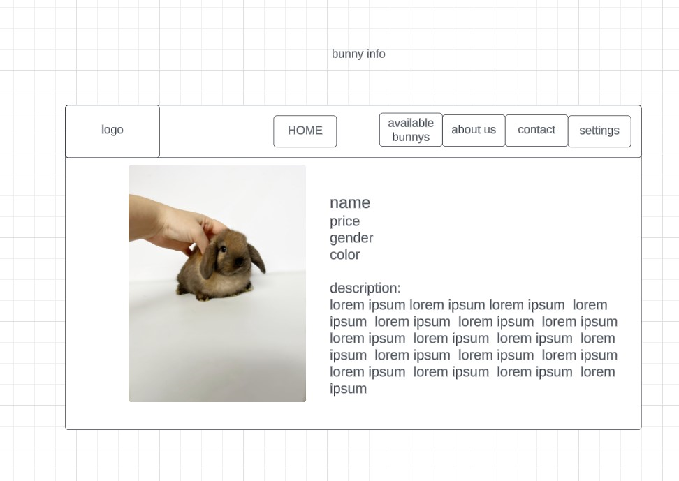
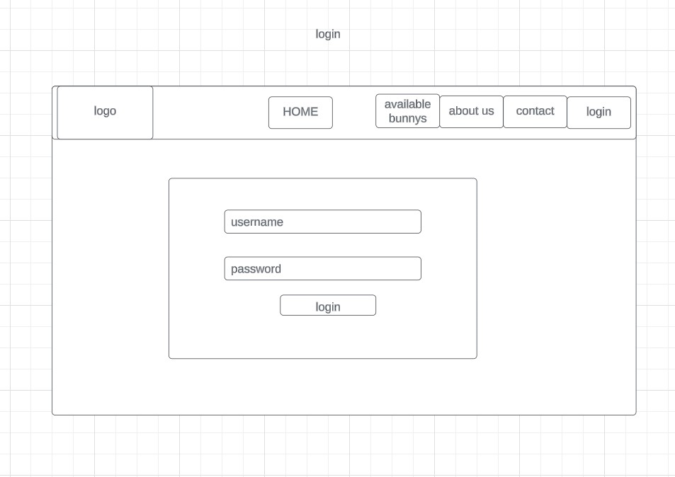
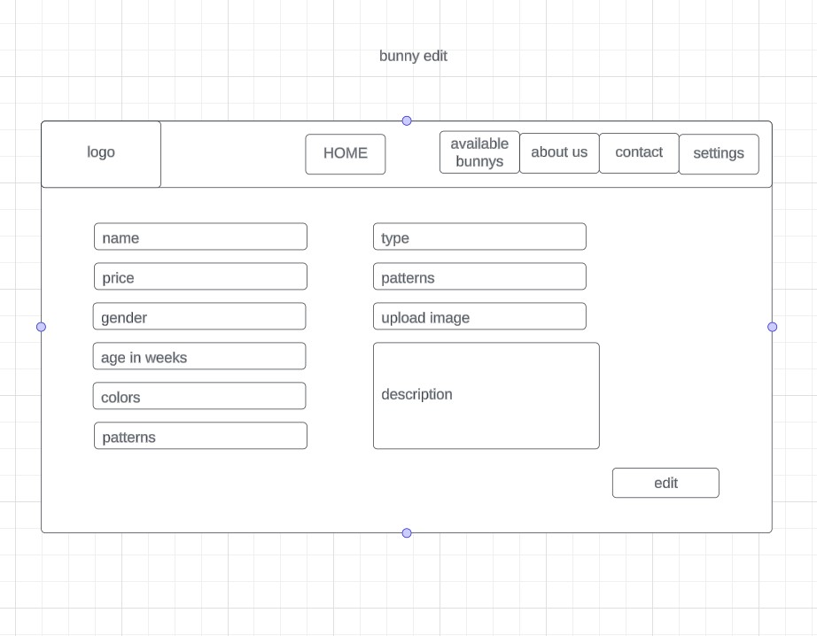
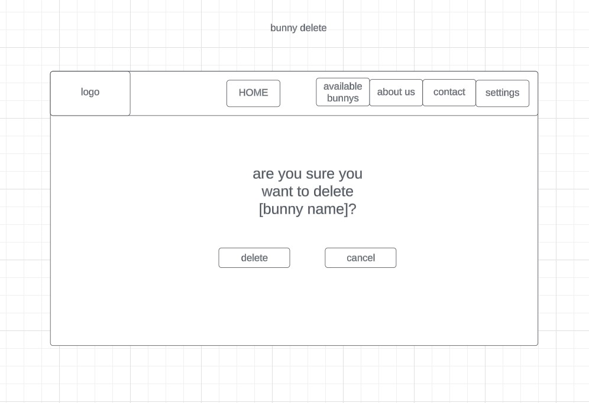

<h3>Lovely Bunnys</h3>
 

This is an website/app where you can purchase a lovely bunny!

 
<h3> ScreenShots</h3>

<h3>User Stories</h3>

Log In

Sign Up

Logout

available bunnys

contact page

bunny create

snacks to feed bunnys

<h3>ERD</h3>

<h3>WireFrame</h3>

<h3>IceBox (Future Updates)</h3>

Be able to buy the bunny for real with debit/credit

>Create a bigger list of actual bunnys for sale not just random photos

Costumize the page into making it look like an actual shop.

